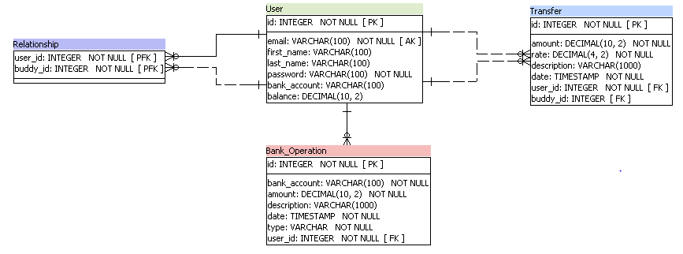

# Pay My Buddy

Pay My Buddy is an application that offers a number of features easing the process of sending and receiving money. It allows users to manage their finances or pay their friends.

## Diagrams

### Class diagram


### Physical data model



## Installation

### Prerequisites

- Java [8+](https://adoptopenjdk.net/?variant=openjdk8&jvmVariant=hotspot)
- Maven [3.6+](https://maven.apache.org/download.cgi)

### Run

Please note that you will have to set up the tables in the databse. For this, please run the sql commands present in the ``` create_db.sql ``` file under the ``` resources ``` folder.

Build the project

```bash
mvn clean install
```
Start the application

```bash
mvn spring-boot:run
```
